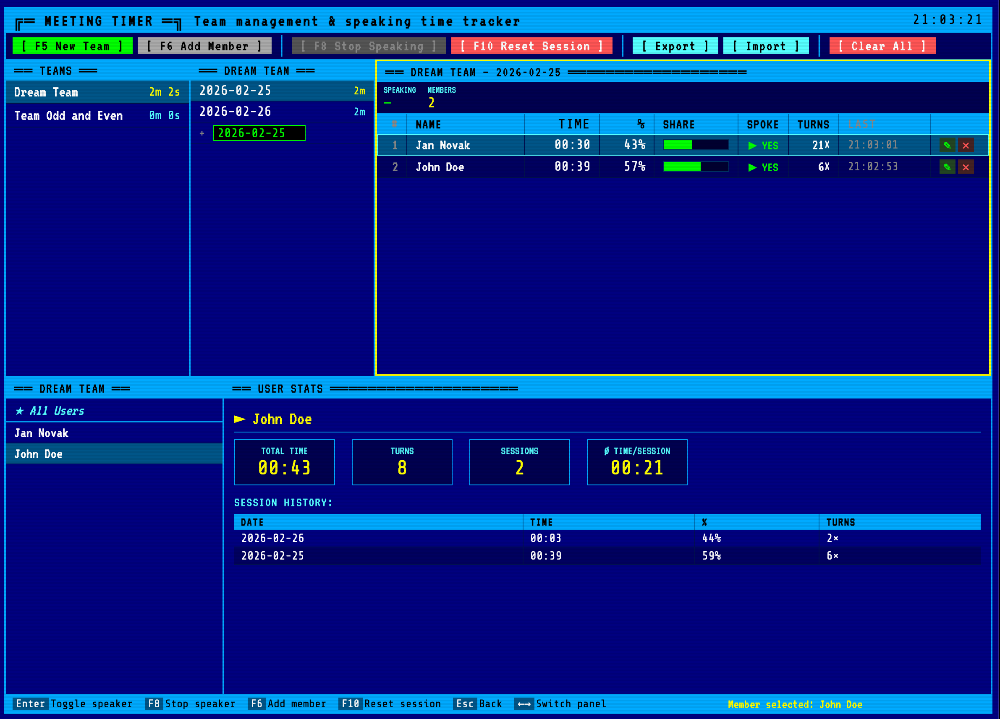

# Meeting Timer

**Live: [m0jimo.github.io/meeting-timer](https://m0jimo.github.io/meeting-timer/)**




A retro DOS/TUI-styled meeting timer for tracking speaker time across team sessions.

> **Human-designed, AI-coded.** The concept, requirements, layout decisions, and direction were defined by [m0jimo](https://github.com/m0jimo). All code was written by [Claude](https://claude.ai) (Anthropic's AI assistant) under human guidance and review.

## Background

Daily stand-ups and team meetings often have an unnoticed problem: talk time is not evenly distributed. Some team members consistently take up significantly more time than others, which can slow down meetings and leave less room for the rest of the team.

This application was created to bring visibility to that imbalance. By timing each speaker individually across sessions, teams can spot patterns over time — and use that awareness to keep meetings more balanced and efficient. It is intentionally simple: no accounts, no server, no setup. Just open it in a browser and start tracking.

## Features

- Track multiple teams and team members
- Record meeting sessions by date
- Time individual speakers with start/stop controls
- View per-member stats (total talk time, turns, average)
- Keyboard navigation between panels
- Norton Commander / DOS aesthetic

## Usage

Open `src/index.html` directly in a browser — no build step, no dependencies. Reload page after change.

## Layout

```
┌─ Teams ──┬─ Sessions ──┬─ Recording Zone ─────────────────┐
│          │             │ (visible when a session is active) │
├─ Members ┴─────────────┴─ Stats ───────────────────────────┤
│          (always visible)                                   │
└─────────────────────────────────────────────────────────────┘
```

## Keyboard Shortcuts

| Key | Action |
|-----|--------|
| `Tab` / `Shift+Tab` | Cycle panel focus forward / backward |
| `←` / `→` | Switch between panels |
| `↑` / `↓` | Navigate items in focused panel |
| `Enter` | Select item / confirm / toggle speaker (recording panel) |
| `Escape` | Deselect session / close dialog |
| `F1` | Open help screen |
| `F2` | Rename selected team or member |
| `F5` | New team |
| `F6` | Add member |
| `F8` | Stop current speaker *(recording mode)* |
| `F10` | Reset session *(recording mode)* / Clear all data |
| `Delete` | Delete selected team, session, or member |

## Data

Persisted to `localStorage` under the key `meeting-timer-v3`.

```
teams:    [{ id, name, members: [{ id, name }] }]
sessions: { teamId: { dateStr: [{ memberId, totalMs, turns }] } }
```
